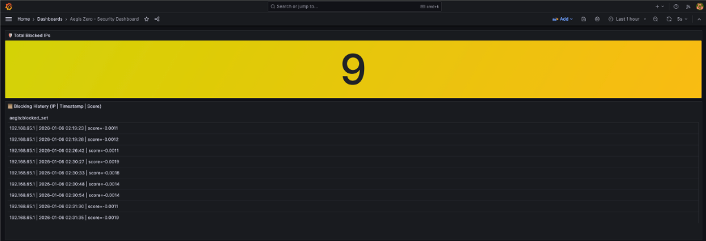
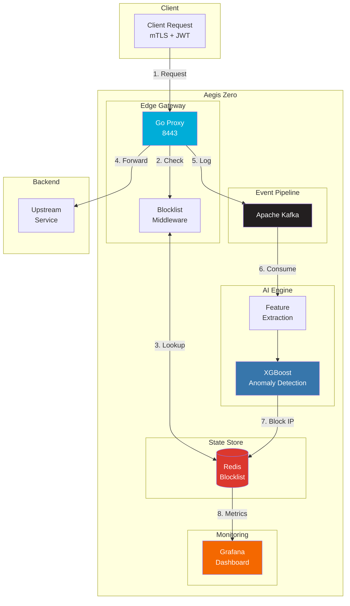

# Aegis Zero

**AI-Powered Zero Trust Edge Proxy**

A cloud-native security gateway that combines high-performance networking with machine learning-based anomaly detection to protect upstream services from malicious traffic.



## What It Does

- **Zero Trust Enforcement**: Strict mTLS and RS256 JWT validation on every request
- **Real-time Threat Detection**: XGBoost model trained on CICIDS2017 network intrusion dataset
- **Automatic IP Blocking**: Detected threats are blocked in Redis with 5-minute TTL
- **Live Dashboard**: Grafana visualization of blocked IPs and security events

## Architecture



## Tech Stack

| Component | Tech | Purpose |
|-----------|------|---------|
| Edge Proxy | Go 1.21 | High-concurrency reverse proxy |
| AI Engine | Python 3.11, XGBoost | Anomaly detection |
| Message Queue | Apache Kafka | Async event streaming |
| State Store | Redis 7 | IP blocklist |
| Dashboard | Grafana | Real-time monitoring |
| Orchestration | Docker Compose | Multi-container deployment |

---

## Getting Started

### Prerequisites

- Docker & Docker Compose
- OpenSSL (for cert generation)

### Setup

```bash
# Clone the repo
git clone https://github.com/yourusername/aegis-zero.git
cd aegis-zero

# Generate TLS certificates
chmod +x certs/generate.sh
./certs/generate.sh

# Start all services
docker-compose up -d
```

### Verify It's Running

```bash
# Check service health
docker-compose ps

# Test the proxy (requires valid client cert + JWT)
cd tests
python3 generate_jwt.py > /tmp/token.txt

curl --cert ../certs/client.crt --key ../certs/client.key \
     -H "Authorization: Bearer $(cat /tmp/token.txt)" \
     -k https://localhost:8443/get
```

### Access Points

| Service | URL | Credentials |
|---------|-----|-------------|
| Proxy | https://localhost:8443 | mTLS + JWT required |
| Grafana | http://localhost:3002 | admin / admin |

---

## Testing Attack Scenarios

We tested 3 real-world attack simulations to validate the AI model:

### Run All Attack Scenarios

```bash
cd tests
python3 realistic_attack.py --scenario all
```

### Test Results

| Attack Type | Requests | Blocked | Block Rate |
|-------------|----------|---------|------------|
| **DDoS** (150 workers, 25s) | 659 | 350 | **53.1%** |
| **Web Scraping** (100 workers, 25s) | 514 | 488 | **94.9%** |
| **Data Exfiltration** (50 workers, 100KB payloads) | 326 | 151 | **46.3%** |

### How Detection Works

1. **Initial requests pass** - AI needs traffic to analyze patterns
2. **Features extracted** - Request rate, payload size, response latency, etc.
3. **XGBoost scores the IP** - Score < -0.001 = anomaly
4. **IP blocked in Redis** - All subsequent requests get 403 Forbidden
5. **Dashboard updated** - Grafana shows blocking history

### Individual Scenario Testing

```bash
# DDoS simulation
python3 realistic_attack.py --scenario ddos --duration 20 --workers 100

# Web scraping simulation  
python3 realistic_attack.py --scenario scraping --duration 20 --workers 80

# Data exfiltration simulation
python3 realistic_attack.py --scenario exfiltration --duration 15 --workers 30
```

---

## Configuration

### Environment Variables

| Variable | Default | Description |
|----------|---------|-------------|
| `UPSTREAM_URL` | - | Target backend URL |
| `REDIS_URL` | `aegis-redis:6379` | Redis connection |
| `KAFKA_BROKERS` | `aegis-kafka:9092` | Kafka brokers |
| `ANOMALY_THRESHOLD` | `-0.001` | Detection sensitivity (lower = stricter) |
| `BLOCK_TTL_SECONDS` | `300` | IP block duration (5 min) |

### Tuning Sensitivity

The `ANOMALY_THRESHOLD` represents the attack probability threshold (negated for convention):

| Threshold | Attack Probability | Behavior |
|-----------|-------------------|----------|
| `-0.0005` | >0.05% | Strict - blocks more, higher false positives |
| `-0.001` | >0.1% | **Default** - balanced |
| `-0.005` | >0.5% | Lenient - fewer false positives, may miss subtle attacks |

*The XGBoost model outputs attack probability (0-1). We negate it so "lower = more suspicious" for consistency.*

---

## Project Structure

```
aegis-zero/
├── proxy/                  # Go edge proxy (core gateway)
│   ├── main.go
│   ├── middleware/         # mTLS, JWT, blocklist checks
│   └── handler/            # Reverse proxy logic
│
├── ai-engine/              # Python AI service
│   ├── main.py             # Entry point
│   ├── detector.py         # XGBoost inference
│   ├── features.py         # Feature extraction
│   ├── blocker.py          # Redis blocklist
│   ├── consumer.py         # Kafka consumer
│   └── models/             # Trained model files
│
├── grafana/                # Dashboard provisioning
│   └── provisioning/
│
├── certs/                  # TLS/JWT certificates
│   ├── generate.sh         # Certificate generator
│   ├── ca.crt/key          # Certificate Authority
│   ├── server.crt/key      # Server TLS
│   ├── client.crt/key      # Client mTLS
│   └── jwt_*.pem           # JWT signing keys
│
├── tests/                  # Attack simulation
│   ├── realistic_attack.py # DDoS, Scraping, Exfiltration tests
│   └── generate_jwt.py     # JWT token generator
│
├── notebooks/              # Model training (Colab)
│   └── train_final_model.ipynb
│
├── docs/                   # Documentation assets
│   └── dashboard_screenshot.png
│
└── docker-compose.yml
```

---

## Local Development

### Proxy (Go)

```bash
cd proxy
go mod download
go build -o aegis-proxy .

UPSTREAM_URL=https://httpbin.org \
REDIS_URL=localhost:6379 \
KAFKA_BROKERS=localhost:9092 \
./aegis-proxy
```

### AI Engine (Python)

```bash
cd ai-engine
python -m venv venv
source venv/bin/activate
pip install -r requirements.txt

REDIS_URL=localhost:6379 \
KAFKA_BROKERS=localhost:9092 \
python main.py
```

---

## Model Training

The XGBoost model is trained on the CICIDS2017 dataset (Canadian Institute for Cybersecurity IDS 2017):

- **2.8M+ network flows** with 80 features
- **Attack types**: DDoS, Brute Force, Web Attacks, Botnet, Port Scan

Training notebook: `notebooks/train_final_model.ipynb` (designed for Google Colab)

### Features Used

| Feature | Description |
|---------|-------------|
| Bwd Pkt Len Std | Backward packet length standard deviation |
| Flow Bytes/s | Bytes per second in flow |
| Flow Pkts/s | Packets per second in flow |
| Fwd IAT Mean | Forward inter-arrival time mean |
| Total Fwd Pkts | Total forward packets |

---

## Stopping Services

```bash
docker-compose down

# Remove volumes (clears Redis data)
docker-compose down -v
```
